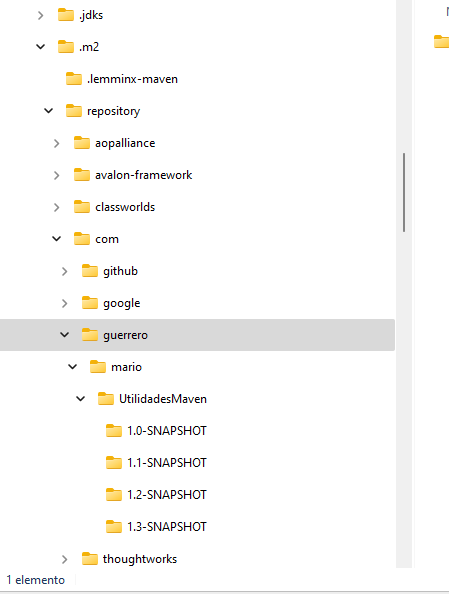
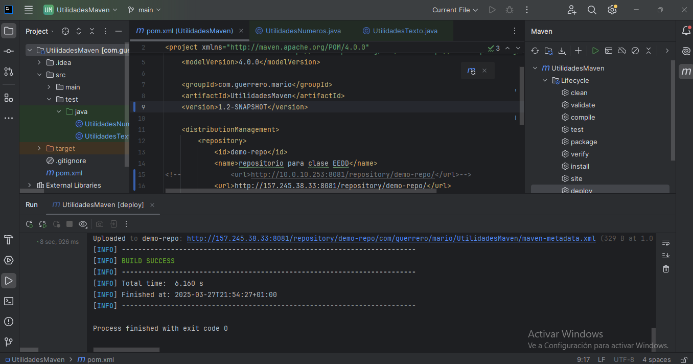
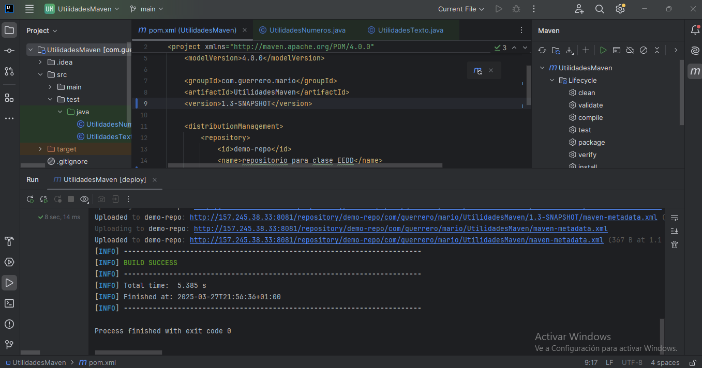
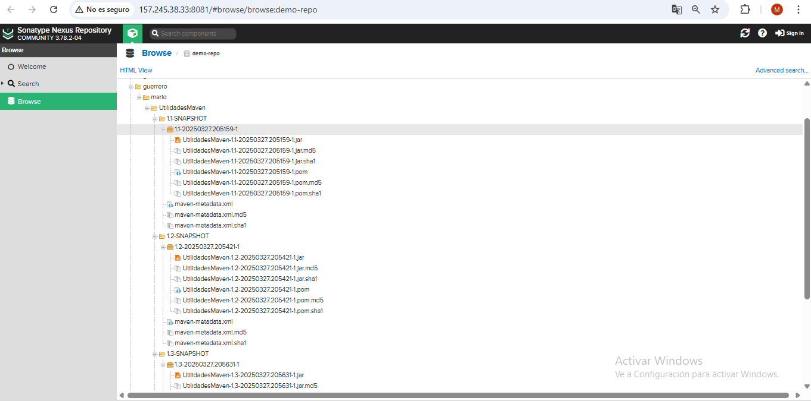

# Ejercicio 3.4 - Maven

El objetivo de este ejercicio es crear un proyecto/librería que utilice Maven como sistema de construcción y gestión de dependencias.

### Entrega

Guarda este proyecto en tu repositorio de Github, dentro de la carpeta `TE\3.4`, con el nombre `UtilidadesMaven`. Copia este documento en el `README.md` del proyecto. Crea también uan carpeta llamada `_res/img` y guarda las capturas de pantalla que se solicitan en este documento. 

### Enunciado

Crea un proyecto Maven con las siguientes características:

1. **`groupId`**: `com.{apellido1}.{nombre}`.
2. **`artifactId`**: `utilidades`.
3. **`version`**: `1.0-SNAPSHOT`.

Crea una clase, dentro del paquete `com.{apellido1}.{nombre}`, con la clase.

- `UtilidadesNumeros`:
  - Método `esPar(int numero)`: devuelve `true` si el número es par, `false` en caso contrario.
  - Método `esImpar(int numero)`: devuelve `true` si el número es impar, `false` en caso contrario.
  - Método `esPrimo(int numero)`: devuelve `true` si el número es primo, `false` en caso contrario.
  - Método `factorial(int numero)`: devuelve el factorial del número.
  - Método `devolverDivisores(int numero)`: devuelve un `List<Integer>` con los divisores del número.
  - Método `esPerfecto(int numero)`: devuelve `true` si el número es perfecto, `false` en caso contrario.

- `UtilidadesTexto`:
  - Método `esPalindromo(String cadena)`: devuelve `true` si la cadena es un palíndromo, `false` en caso contrario.
  - Método `contarVocales(String cadena)`: devuelve el número de vocales en la cadena.
  - Método `contarConsonantes(String cadena)`: devuelve el número de consonantes en la cadena.
  - Método `contarPalabras(String cadena)`: devuelve el número de palabras en la cadena.
  - Método `contarCaracteres(String cadena)`: devuelve el número de caracteres en la cadena.


Dentro del proyecto, crea una clase `TestUtilidadesNumeros` y `TestUtilidadesTexto` con métodos para probar las funcionalidades de las clases anteriores.

Dentro del archivo `pom.xml`, indica lo siguiente:

- formato de empaquetado: `jar`.
- versión de Java: `21`.
  
**Versionado de la librería**:

Debes crear diferentes versiones de la librería, modificando el número de versión en el archivo `pom.xml`.

> Versión 1.1:
  
`UtilidadesNumeros`:
  - Método `esPar(int numero)`: devuelve `true` si el número es par, `false` en caso contrario.
  - Método `esImpar(int numero)`: devuelve `true` si el número es impar, `false` en caso contrario.


`UtilidadesTexto`:
  - Método `esPalindromo(String cadena)`: devuelve `true` si la cadena es un palíndromo, `false` en caso contrario.
  - Método `contarVocales(String cadena)`: devuelve el número de vocales en la cadena.

> Versión 1.2:

`UtilidadesNumeros`:
  - Método `esPrimo(int numero)`: devuelve `true` si el número es primo, `false` en caso contrario.
  - Método `factorial(int numero)`: devuelve el factorial del número.

`UtilidadesTexto`:
  - Método `contarConsonantes(String cadena)`: devuelve el número de consonantes en la cadena.
  - Método `contarPalabras(String cadena)`: devuelve el número de palabras en la cadena.

> Versión 1.3:

`UtilidadesNumeros`:
  - Método `devolverDivisores(int numero)`: devuelve un `List<Integer>` con los divisores del número.
  - Método `esPerfecto(int numero)`: devuelve `true` si el número es perfecto, `false` en caso contrario.

`UtilidadesTexto`:
  - Método `contarPalabras(String cadena)`: devuelve el número de palabras en la cadena.
  - Método `contarCaracteres(String cadena)`: devuelve el número de caracteres en la cadena.


> Puedes incluir todo el código, pero es necesario incluir en cada versión solo los métodos que se han indican en la documentación. (Puedes comentar/descomentar los métodos para cada versión).


### 1. Configurar repositorio Maven de clases

**Agregar respositorio maven local**

- Dentro del fichero `pom.xml` añadir el siguiente fragmento de código:

```xml
<distributionManagement>
    <repository>
        <id>local-repo</id>
        <url>file:///${project.basedir}/.m2/repository</url>
    </repository>
</distributionManagement>
```

Donde `${project.basedir}` es la ruta del proyecto. En este caso, crear una carpeta `.maven-{tu_nombre}` en la carpeta `home` del usuario.


**Instalar en repositorio local**

Desde la terminal, ejecuta los siguientes comandos:

1. `mvn clean package`.
2. `mvn install`.

Esto generará un archivo `.jar` y lo instalará en el repositorio local.

**Comprobar que el archivo se ha subido correctamente**

En la carpeta `.m2\repository` tendrás instalado el archivo `.jar` de tu proyecto, con la estructura de carpetas de package. En este caso, `com/{apellido1}/{nombre}/utilidades/1.1/utilidades-1.1.jar`.

> Incluye una captura de pantalla donde se visualice la estructura de carpetas y el nombre de carpeta raiz del repositorio local.

> `Crea una carpeta llamada "_resources/img" y guarda las capturas. Vincula estas imágenes al `.


**Repetir proceso para cada versión de la librería**.

> Version 1.2

- Cambia la versión en el archivo `pom.xml` y despliega la nueva versión en el repositorio local.
- Adjunta una captura de pantalla.


> Version 1.3

- Cambia la versión en el archivo `pom.xml` y despliega la nueva versión en el repositorio local.
- Adjunta una captura de pantalla.



#### 2. Agregar repositorio maven hosted

- Dentro del fichero `pom.xml` cambiar la configuración de `distribución` siguiente fragmento de código:<br>
*La dirección os la indica el profesor en clase*

```xml
<distributionManagement>
    <repository>
        <id>demo-repo</id>
        <url>http://<ip_del_servidor>:8081/...</url>
    </repository>   
</distributionManagement>
```

**Agregar configuración de repositorio**

- Dentro del fichero `settings.xml` de Maven, en `%userprofile%\.m2\settins.xml` añadir el siguiente fragmento de código:

```xml
<servers>
    <server>
        <id>demo-repo</id>
        <username>alumnouser</username>
        <password>alumnouser</password>
    </server>
</servers>
```

> Si no existe, el formato del fichero es el siguiente:

```xml
<settings xmlns="http://maven.apache.org/SETTINGS/1.0.0" xmlns:xsi="http://www.w3.org/2001/XMLSchema-instance"
  xsi:schemaLocation="http://maven.apache.org/SETTINGS/1.0.0 https://maven.apache.org/xsd/settings-1.0.0.xsd">
  <localRepository/>
  <interactiveMode/>
  <offline/>
  <pluginGroups/>
  <servers>
    
  </servers>	
  <mirrors/>
  <proxies/>
  <profiles/>
  <activeProfiles/>
</settings>
```

Esto es necesario para poder subir el proyecto al repositorio hosted. Se debe indicar que el repositorio maven existe, ya que si no se indica, Maven no conoce la configuración de acceso a este repositorio.

**Subir el proyecto al repositorio hosted**

Repite el proceso anterior, pero en lugar de ejecutar `mvn install`, ejecuta `mvn deploy`.

1. `mvn clean package`.
2. `mvn deploy`.

Esto generará un archivo `.jar` y lo desplegará en el repositorio local.

**Comprobar que el archivo se ha subido correctamente**

Accede a la dirección del repositorio maven hosted y comprueba que el archivo se ha subido correctamente, utilizando las credenciales de acceso `alumnouser` y `alumnouser` (password).

> Incluye una captura de pantalla donde se visualice el archivo `.jar` en el repositorio maven hosted.


**Repetir proceso para cada versión de la librería**.

> Version 1.2

- Cambia la versión en el archivo `pom.xml` y despliega la nueva versión en el repositorio local.
- Adjunta una captura de pantalla.


> Version 1.3

- Cambia la versión en el archivo `pom.xml` y despliega la nueva versión en el repositorio local.
- Adjunta una captura de pantalla.


